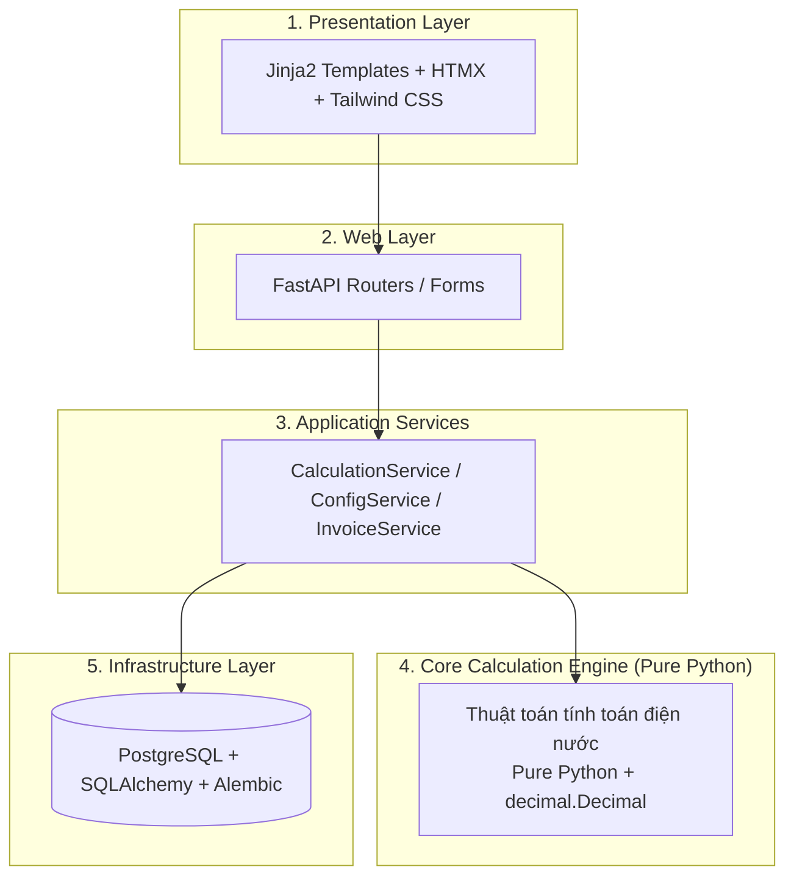
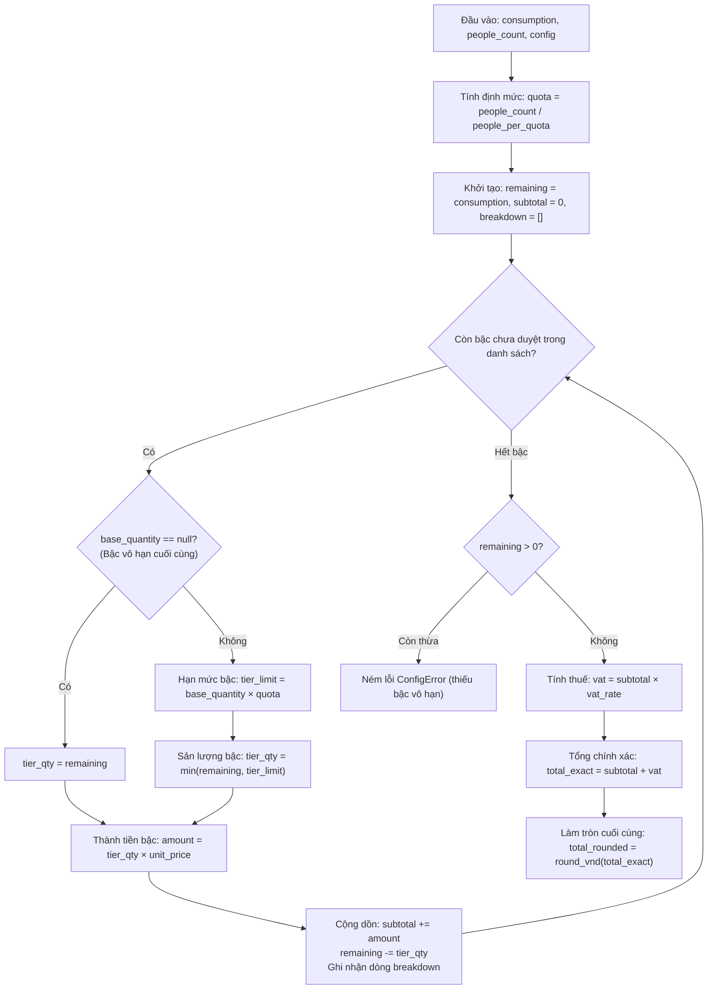

# Kiến Trúc Hệ Thống RentCalc

> Trạng thái: **VERIFIED v0.2** (Khớp 100% với cài đặt `app/core` và 32/32 tests passed).

---

## 1. Mô Hình Phân Tầng (Layered Architecture)

Hệ thống RentCalc được thiết kế theo mô hình **Modular Monolith** kết hợp nguyên lý **Clean Architecture**, đảm bảo phân tách trách nhiệm rõ ràng giữa các tầng:



### Nguyên tắc phân tầng bắt buộc:

- **Tầng Core độc lập 100%**: Không phụ thuộc vào web framework, database, biến môi trường hay file hệ thống.
- **Quy tắc cấm import ngược**: Tầng `app/core` TUYỆT ĐỐI KHÔNG import từ `fastapi`, `sqlalchemy`, `alembic`, `app.db`, `app.web`.
- **Dòng dữ liệu đơn chiều**: Yêu cầu đi từ Presentation -> Web -> Service -> Core / Infrastructure.

---

## 2. Đặc Tả Thuật Toán Tính Điện Bậc Thang (Tiered Algorithm)

Sơ đồ dưới đây mô tả chính xác vòng lặp phân bổ sản lượng điện theo định mức Q và cộng dồn lũy tiến 6 bậc:



---

## 3. Cấu Trúc Thư Mục `app/core`

```txt
app/core/
├── __init__.py          # Package initialization
├── errors.py            # Hệ thống ngoại lệ phân cấp (RentCalcError, ConfigError, InputError...)
├── types.py             # Cấu trúc dữ liệu bất biến (frozen dataclasses, Decimal)
├── decimal_utils.py     # Tiện ích số học chính xác cao (prec=50, round_vnd HALF_UP)
├── meter.py             # Xử lý chỉ số và quay vòng công tơ cơ khí
├── quota.py             # Tính định mức số hộ Q (không làm tròn)
├── electricity.py       # Tính điện bậc thang lũy tiến và đồng giá không kê khai
├── water.py             # Tính tiền nước (theo khối hoặc theo đầu người)
└── comparison.py        # Đối chiếu số tiền thực thu và cảnh báo thu vượt
```
