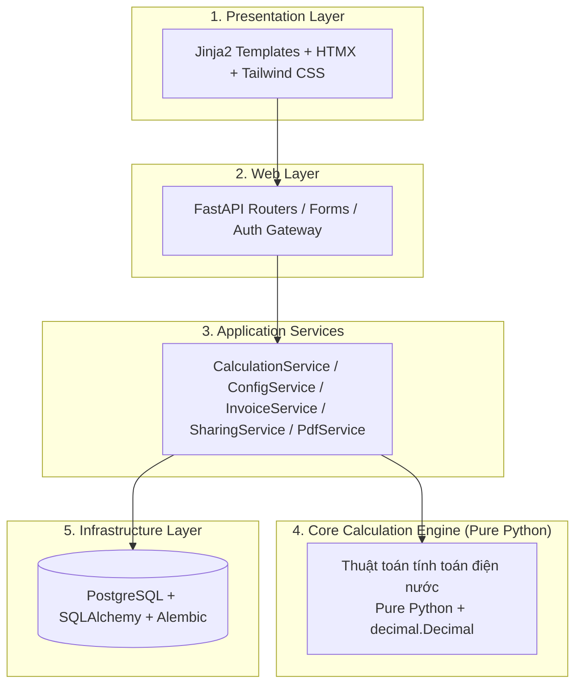
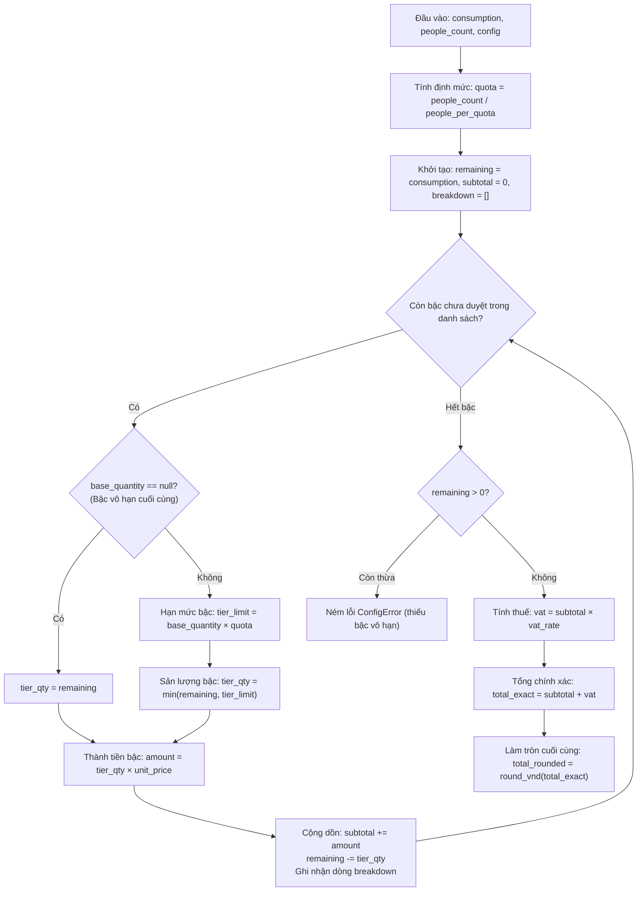

# Kiến Trúc Hệ Thống RentCalc

> Trạng thái: **VERIFIED v1.0.0** (Khớp 100% với cài đặt hệ thống và 63/63 tests passed, 85% coverage).

---

## 1. Mô Hình Phân Tầng (Layered Architecture)

Hệ thống RentCalc được thiết kế theo mô hình **Modular Monolith** kết hợp nguyên lý **Clean Architecture**, đảm bảo phân tách trách nhiệm rõ ràng giữa các tầng:



### Nguyên tắc phân tầng bắt buộc:

- **Tầng Core độc lập 100%**: Không phụ thuộc vào web framework, database, biến môi trường hay file hệ thống.
- **Quy tắc cấm import ngược**: Tầng `app/core` TUYỆT ĐỐI KHÔNG import từ `fastapi`, `sqlalchemy`, `alembic`, `app.db`, `app.web`.
- **Dòng dữ liệu đơn chiều**: Yêu cầu đi từ Presentation -> Web -> Service -> Core / Infrastructure.

---

## 2. Đặc Tả Thuật Toán Tính Điện Bậc Thang (Tiered Algorithm)

Sơ đồ dưới đây mô tả chính xác vòng lặp phân bổ sản lượng điện theo định mức Q và cộng dồn lũy tiến N bậc (cấu hình động linh hoạt):



---

## 3. Cấu Trúc Thư Mục `app/core`

```txt
app/core/
├── __init__.py          # Package initialization
├── errors.py            # Hệ thống ngoại lệ phân cấp (RentCalcError, ConfigError, InputError...)
├── types.py             # Cấu trúc dữ liệu bất biến (frozen dataclasses, Decimal)
├── decimal_utils.py     # Tiện ích số học chính xác cao (prec=50, round_vnd HALF_UP)
├── meter.py             # Xử lý chỉ số và quay vòng công tơ cơ khí
├── quota.py             # Tính định mức số hộ Q (không làm tròn)
├── electricity.py       # Tính điện bậc thang lũy tiến và đồng giá không kê khai
├── water.py             # Tính tiền nước (theo khối hoặc theo đầu người)
├── comparison.py        # Đối chiếu số tiền thực thu và cảnh báo thu vượt
└── month.py             # Xác thực và chuẩn hóa định dạng kỳ tính phí YYYY-MM
```

---

## 4. Kiến Trúc Xác Thực & Phân Quyền (Security & Access Control)

Hệ thống thiết lập cơ chế kiểm soát truy cập phân lớp chặt chẽ:

- **Cổng xác thực (Auth Gateway):** Khi chưa đăng nhập, người dùng chỉ được truy cập giao diện đăng nhập (`/login`). Mọi yêu cầu truy cập trang chủ (`/`) hoặc các trang quản trị, danh sách hóa đơn đều tự động chuyển hướng về `/login`.
- **Tuyến công khai được bảo lưu:**
  - `/login`: Giao diện đăng nhập.
  - `/share/{token}` & `/share/{token}/pdf`: Trang tra cứu hóa đơn minh bạch dành cho người thuê không cần đăng nhập.
  - `/health`: Giám sát sức khỏe ứng dụng cho Docker và CI/CD.
  - `/static/...`: Tệp tĩnh CSS/JS giao diện.
- **Bảo mật phiên làm việc (Session Cookie):** Sử dụng chữ ký số HMAC-SHA256 (`user_id.signature`) kèm cờ `HttpOnly`, `SameSite=Lax` và tự động bật `Secure` trên môi trường Production, ngăn chặn tấn công giả mạo quyền hạn. Mật khẩu được băm bằng PBKDF2-HMAC-SHA256 với salt ngẫu nhiên 16 bytes.
- **Phân quyền vai trò (Role-Based Access Control - RBAC):**
  - `owner` (Chủ cơ sở): Toàn quyền quản lý cơ sở, phòng trọ, ghi chỉ số công tơ, phát hành hóa đơn và quản trị cấu hình biểu giá nhà nước.
  - `tenant` (Người thuê): Giới hạn truy cập, chỉ xem hóa đơn của chính phòng mình tại `/my-invoices`. Mọi hành vi truy cập trái phép vào trang quản trị đều bị chặn đứng (HTTP 403 Forbidden).
