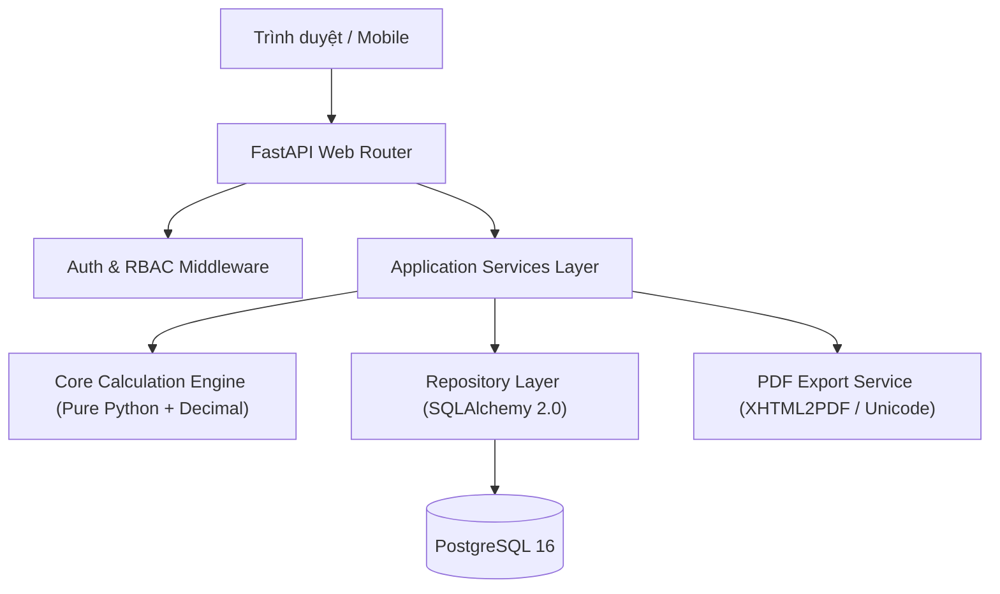

# Slide Deck — RentCalc Presentation (15 phút)

## Slide 1: Title (30 giây)
- **Tiêu đề:** RentCalc — Hệ thống Quản trị & Minh bạch hóa Chi phí Dịch vụ Thiết yếu (Điện & Nước) Nhà trọ
- **Tác giả:** Trần Vũ Hoa Phát
- **Kỳ thi:** Olympic Tin học Sinh viên 2026 — Khối Phần mềm Nguồn mở (PMNM)
- **Giấy phép:** Mã nguồn mở MIT License

## Slide 2: Vấn đề thực tế (1 phút)
- **Thực trạng nhức nhối:** Người thuê trọ (sinh viên, người lao động) thường xuyên bị áp giá điện cố định từ 3.500 – 4.500 đ/kWh, cao hơn nhiều so với bậc lũy tiến Nhà nước.
- **Rào cản pháp lý:** Ít người nắm rõ quy chuẩn tính toán và biểu giá điện sinh hoạt 6 bậc (QĐ 2741/QĐ-BCT).
- **Chế tài xử phạt:** Điều 31 Nghị định 133/2026/NĐ-CP quy định phạt tiền từ 20 – 30 triệu đồng đối với hành vi thu tiền điện nước cao hơn quy định, nhưng thiếu công cụ giám sát và đối chiếu tự động.

## Slide 3: Đối tượng người dùng & Lợi ích (30 giây)
- **Chủ cơ sở cho thuê:**
  - Quản lý tập trung nhiều dãy trọ, phòng trọ, công tơ cơ khí.
  - Tự động hóa phát hành hóa đơn đúng luật, tránh rủi ro vi phạm hành chính.
- **Người thuê phòng:**
  - Nhận bảng bóc tách chi tiết từng kWh điện theo bậc thang và định mức số người.
  - Đối chiếu minh bạch giữa số tiền thực đóng và giá quy định Nhà nước.
  - Xem hóa đơn và tải PDF mọi lúc qua link chia sẻ bảo mật không cần tài khoản.

## Slide 4: Giải pháp kỹ thuật (1,5 phút)
- **Tách bạch 3 tầng (Clean Layered Architecture):**
  - **Core Engine:** Thuần Python, 100% độc lập với Web/DB, tính toán tài chính chính xác tuyệt đối bằng `Decimal` (zero float loss).
  - **Data Persistence:** SQLAlchemy 2.0 + PostgreSQL, hỗ trợ snapshot hóa đơn bất biến theo thời gian.
  - **Presentation Layer:** FastAPI + Jinja2 Templates + Tailwind CSS hiện đại, tối ưu trải nghiệm và khả năng tiếp cận (a11y).
- **Cấu hình biểu giá linh hoạt:**
  - Toàn bộ bậc thang, tỷ lệ thuế VAT, phí BVMT, định mức nước được cấu hình trực quan từ Web Admin, không bao giờ hard-code.

## Slide 5: Kiến trúc tổng thể (1 phút)

- **Nguyên tắc thiết kế:**
  - Single Responsibility Principle.
  - Core Engine không import bất kỳ thư viện web hay ORM nào.
  - Hóa đơn lưu snapshot nguyên trạng: lịch sử hóa đơn không bao giờ bị biến động khi sửa biểu giá tương lai.

## Slide 6: Các tính năng chính (2 phút)
1. **Quản lý đa cơ sở & phòng:** CRUD linh hoạt, phân chia số nhân khẩu để tính định mức nước và điện.
2. **Ghi chỉ số & Xử lý Rollover:** Tự động phát hiện công tơ cơ khí qua vòng (end < start) và tính modulo 100.000 chuẩn xác.
3. **Tính điện bậc thang 6 bậc:** Chuẩn Quyết định 2741/QĐ-BCT, tự động chia định mức theo số người.
4. **Tính nước sinh hoạt:** Hỗ trợ 2 phương thức: theo biểu giá lũy tiến định mức và khoán cố định.
5. **Đối chiếu minh bạch & Cảnh báo NĐ 133:** So sánh số tiền thực thu vs giá chuẩn Nhà nước, kích hoạt banner cảnh báo pháp lý nếu thu vượt.
6. **Xuất PDF hóa đơn chính thức:** Hỗ trợ 100% tiếng Việt có dấu, căn chỉnh chuẩn in ấn.
7. **Chia sẻ hóa đơn công khai:** Token chia sẻ an toàn `/share/{token}`, xem không cần login.
8. **Phân quyền RBAC:** Tách biệt luồng làm việc của Chủ nhà (`owner`) và Khách thuê (`tenant`).

## Slide 7: Kịch bản Trình diễn (Demo Cases) — Phần 1 (1,5 phút)
- **TC-01:** Hóa đơn cơ bản phòng 4 người, tiêu thụ 120 kWh điện (chia theo định mức bậc thang).
- **TC-02:** Hóa đơn tiêu thụ cao (350 kWh điện, 28 m³ nước) chạm các bậc giá cao nhất.
- **TC-03:** Cập nhật biểu giá mới từ Admin và kiểm tra tính bất biến của hóa đơn cũ.

## Slide 8: Kịch bản Trình diễn (Demo Cases) — Phần 2 (1,5 phút)
- **TC-04 (Rollover):** Ghi chỉ số quay vòng 99.850 $\rightarrow$ 00.120 kWh, cảnh báo UI và tính đúng 270 kWh.
- **TC-05 (Overcharge Warning):** Chủ trọ thu khoán 4.000 đ/kWh, hệ thống bật cảnh báo vi phạm Nghị định 133/2026/NĐ-CP và chênh lệch cụ thể.
- **TC-06 & TC-07:** Kiểm thử biên và trường hợp phòng 0 người / không sử dụng dịch vụ.

## Slide 9: Demo trực tiếp — Phân quyền & Chia sẻ công khai (1,5 phút)
- Đăng nhập Chủ trọ (`owner`) quản lý toàn bộ hệ thống.
- Đăng nhập Khách thuê (`tenant101`) vào không gian riêng chỉ xem phòng mình.
- Mở link ẩn danh `/share/{token}` xem bóc tách chi tiết và tải file PDF hóa đơn tiếng Việt.

## Slide 10: Demo trực tiếp — Báo cáo & Cảnh báo vi phạm (1,5 phút)
- Dashboard phân tích tổng thể: số cơ sở, phòng, hóa đơn phát hành.
- Danh sách cảnh báo pháp lý các hóa đơn thu vượt trần kèm số tiền chênh lệch cần hoàn trả.

## Slide 11: Kết quả kiểm thử & Chất lượng mã nguồn (30 giây)
- **51/51 tests pass 100%** tự động trên môi trường CI/CD.
- **Coverage: 85%** toàn bộ ứng dụng.
- **100% tuân thủ PEP 8**, kiểm soát kiểu dữ liệu nghiêm ngặt bằng Pydantic và type hints.
- Xác minh chính xác từng đồng so với kết quả mẫu của Ban Giám khảo.

## Slide 12: Tính bền vững & Sẵn sàng triển khai (1 phút)
- Bộ tài liệu hoàn chỉnh: [INSTALL.md](file:///d:/OLP---RentCalc/docs/INSTALL.md), [DEMO.md](file:///d:/OLP---RentCalc/docs/DEMO.md), [DEPLOY.md](file:///d:/OLP---RentCalc/docs/DEPLOY.md), [ARCHITECTURE.md](file:///d:/OLP---RentCalc/docs/ARCHITECTURE.md).
- Sẵn sàng đóng gói Docker & Nginx Reverse Proxy với health check `/health`.
- Giấy phép mã nguồn mở MIT, ghi nhận đầy đủ bản quyền bên thứ ba.

## Slide 13: Phương hướng phát triển tương lai (1 phút)
- Hỗ trợ công tơ tổng chia cho nhiều phòng có công tơ phụ (Shared Meter Topology).
- Xử lý biểu giá thay đổi giữa kỳ thanh toán (Mid-cycle Tariff Transition).
- Tích hợp cổng thanh toán trực tuyến (VietQR, MoMo) cho người thuê thanh toán trực tiếp.
- Ứng dụng di động (Flutter / React Native) và đồng bộ chỉ số qua ảnh chụp OCR AI.

## Slide 14: Kết luận (30 giây)
- **RentCalc** mang đến một giải pháp mã nguồn mở thiết thực, thúc đẩy sự công bằng và minh bạch trong xã hội.
- Bảo vệ quyền lợi hợp pháp của người thuê trọ và hỗ trợ chủ nhà tuân thủ đúng pháp luật.
- Sẵn sàng triển khai thực tế và đóng góp cho cộng đồng mã nguồn mở Việt Nam.

## Slide 15: Q&A (Hỏi & Đáp) (1 phút)
- Xin chân thành cảm ơn Ban Giám khảo đã lắng nghe!
- Nhóm dự thi sẵn sàng giải đáp mọi thắc mắc và câu hỏi kỹ thuật.
